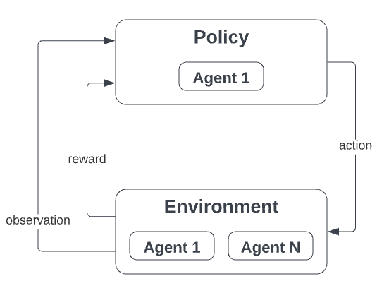

# Simulation Loop

The simulation loop in dojo brings everything together through an iterative process on a per block basis.  
At each step, the agent interacts with the environment by taking actions, receiving observations and rewards, and updating the agent & environment state. 





**This is the basic pattern of the simulation loop:**

<!-- <details><summary> 1. <b>Resetting</b> the environment to its initial state and returning the initial observation </summary><p>

```python
print("hello world!")
```
</p></details> -->


1. Resetting the environemnt to its initial state. Returning inital observations.


1. The simulation loop begins by resetting the environment to its initial state and returning the initial observation to the agent
2. The observations are passed to all agents ->  actions are returned
3. The environments step methods is called with the actions as input
   All actions are then executed, and the environemnt progresses to the next block.
4. The environment returns the reward of all agents plus the new observations, based on the new environment state
5. **Optional** If you are training your strategy, the agent takes the reward function to optimize parameters based on the state-action-reward transition.
6.  At each step in the loop, a termination condition is checked. This condition could be a terminal state, in this case, for example when the agent runs out of money. 
7.  The simulation loop keeps repeating this cycle until a predefined stopping condition is met. 


If you want a reminder on some of the concepts here, take a longer peek at the [environment](./environments/UniswapV3#show-me-the-code), the [agent](./Agents#creating-your-own-agent) or the [policy](./Policies#training) as you see fit 🙂


## Example


```python
import logging
# You can adjust the log level to different granularities
logging.basicConfig(format="%(asctime)s - %(message)s", level=20)

sim_start = datetime(2023, 1, 1)
sim_end = datetime(2023, 1, 2)

demo_agent = WealthAgent(initial_portfolio={"USDC": 10_000})
env = UniV3Env(
    agents=[demo_agent],
    date_range=(sim_start, sim_end)
    pools=["0x8ad599c3A0ff1De082011EFDDc58f1908eb6e6D8"],
    market_impact="replay", # "replay" by default, to replay history
)
policy = DynamicPriceWindowPolicy(
    agent=demo_agent, lower_limit=2000, upper_limit=2500
)

blocks=[]
rewards=[]
obs = env.reset()
for block in env.iter_block():
    policy.fit(obs) # train dynamic policy
    policy_actions = policy.predict(obs)
    market_actions = env.market_actions(policy_actions)
    actions = policy_actions + market_actions # control over action ordering
    obs, rewards, dones, infos = env.step(actions=actions)

    blocks.append(block)
    rewards.append(reward)

plt.plot(blocks, rewards)
```

Th resulting plot looks like this  


<a href={ require("/img/results.png").default }>Download the full script here</a>