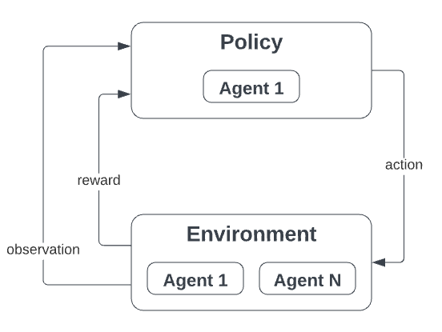

A quick overview of the main simulation loop. Broadly, `dojo` combines principles from [reinforcement learning](https://spinningup.openai.com/en/latest/spinningup/rl_intro.html#key-concepts-and-terminology) and [agent-based modelling](https://en.wikipedia.org/wiki/Agent-based_model) to provide a flexible structure.

:::tip

The general structure of `dojo` is heavily inspired by OpenAI's gymnasium. Check out the [docs](https://gymnasium.farama.org/content/basic_usage/).

:::

## Environments
In the context of `dojo`, environments are DeFi protocols.
The environmet state is a noiseless encoding of the environment at any given point. However, in reality, this state isn't observable (mostly because we don't have complete information on the other agents). Instead, at every simulation step (= every block), the envrionment emits an observation, which is a noisy encoding of the environment, and the rewards generated by all the agents in the simulation. It also receives actions, which it processes to generate the state and observation of the next step.

See [here](./environments) for more details.

## Agents
Agents represent the state of the various agents interacting with the environment within the `dojo` simulation. As such, the environmnet has reference to all agents, each of which can implement their own reward function for metric tracking and, optionally, policy training.

:::note

Agents are NOT responsible for making decisions on how to act in the environment.

:::

See [here](./agents) for more details.

## Policies
This is where you can get creative by implementing your own policy for interacting with the environmnet!  
For example, a basic policy could be the [moving average trading strategy](https://www.investopedia.com/ask/answers/122314/how-do-i-use-moving-average-ma-create-forex-trading-strategy.asp).
At every simulation step, the policy receives an observation from the environment, with which it generates an action to pass back. Optionally, it also receives a reward which can be used to train or fit a model contained within it.

:::note

Each policy has an agent attached to it, on whose behalf it acts.

:::

See [here](./policies) for more details.

